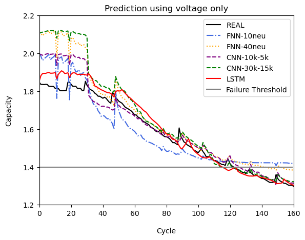
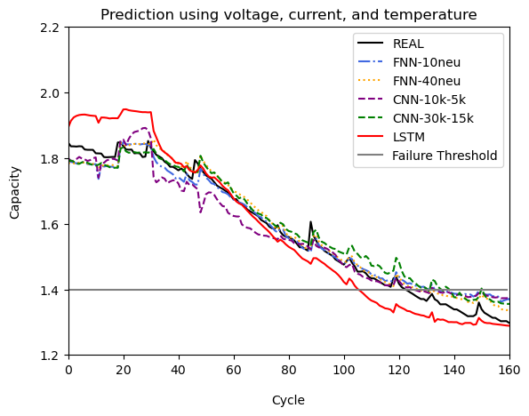

## NASA Lithium-ion Battery SoH Prediction
### latest version : 2024/02/14 by JuYeon

### 📌 Description
- **"Machine Learning-Based Lithium-Ion Battery Capacity Estimation Exploiting Multi-Channel Charging Profiles"** 리프로덕션
(https://ieeexplore.ieee.org/document/8731962)
- Data from **NASA PCoE**(https://www.nasa.gov/intelligent-systems-division/discovery-and-systems-health/pcoe/pcoe-data-set-repository/)
- Framework : **PyTorch**
- model type : FNN / CNN / LSTM
- Use **charging** datas and capacity data

### 📌 Directorys & Files
- DATA/RAW : raw data (**.mat** files)
- DATA/DataFrame : extracted charge and capacity data ( **.csv** files )
- BEST_MODEL : parameters of best models ( **.pt** files)
- PREDICT : prediction of B0005's capacity
- Train_SCModels : training Models using B0006/B0007/B0018's voltage data only & Predict B0005's capacity (single-channel)
- Train_MCModels : training Models using B0006/B0007/B0018's voltage, current, temperature & Predict B0005's capacity (multi-channel)

### 📌 Conclusion

